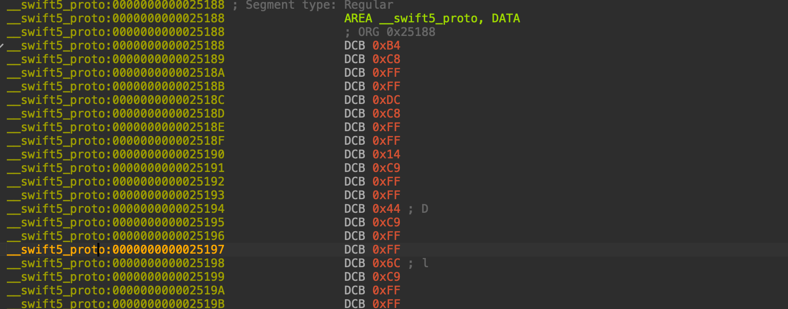
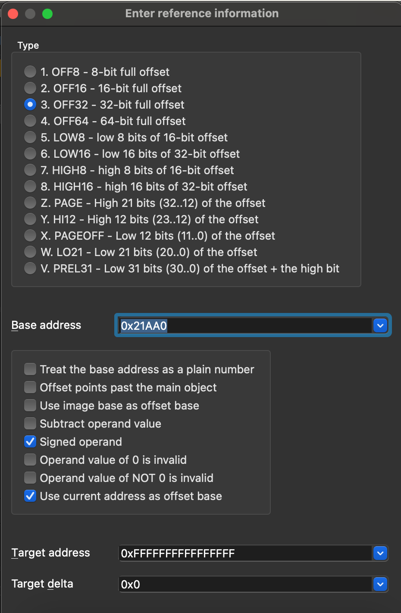
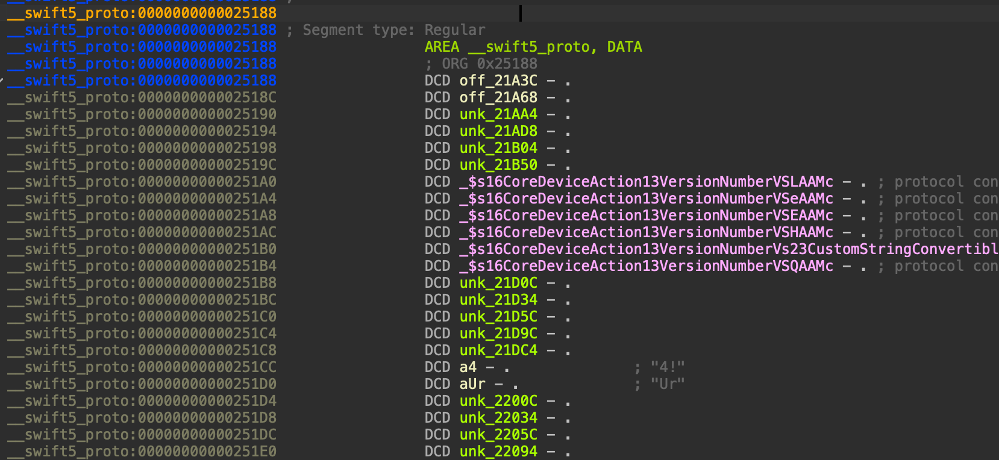
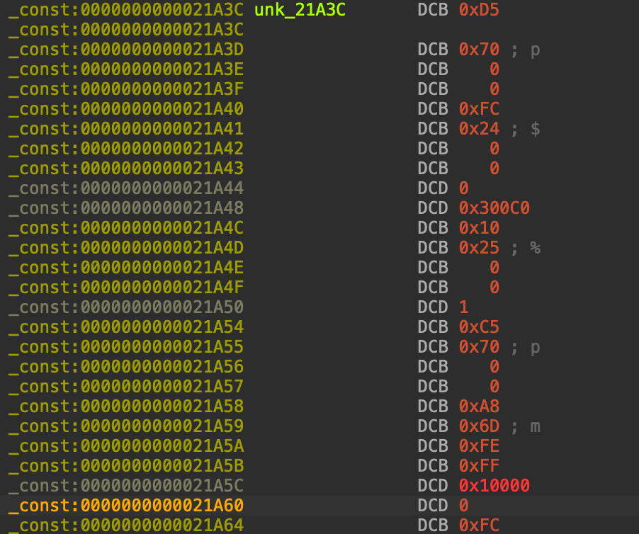
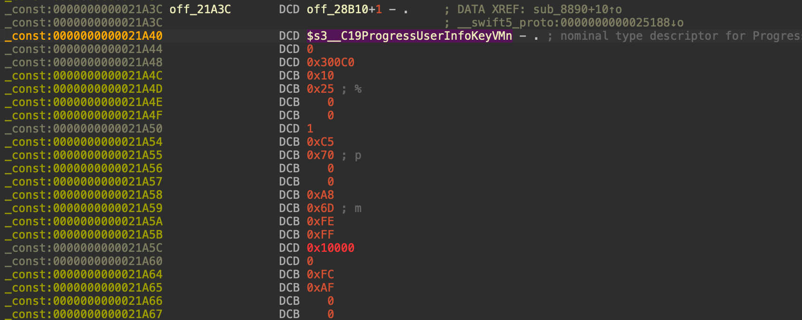
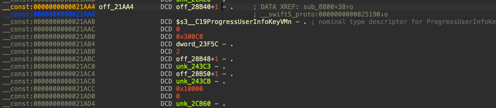
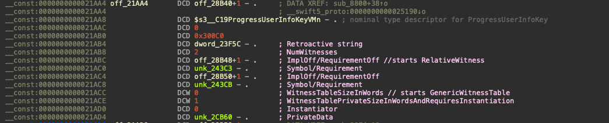
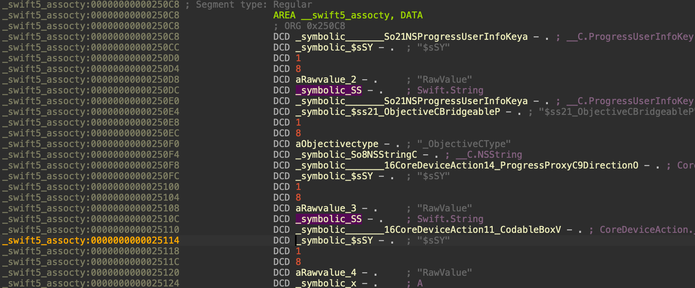

## Practical swift example

Before starting, please read this: <https://github.com/swiftlang/swift/blob/main/docs/Lexicon.md>.

For this example, we will reverse the CoreDeviceAction framework contained in the DDI (Developer Disk Image) that can be mounted in iOS. Note that this is just an example for you to follow along. The things applied here can be applied to any lib/binary you want to reverse.

We'll first begin by loading the binary into IDA. Once loaded, we'll go into the Segments section.

Once there, navigate to `swift5_proto`. Recall from the README.md that this segment contains a list of relative pointers to __Protocol Conformance Descriptor(s)__ (which will point to the __const segment). This the structure of a single Protocol Conformance Descriptor (these are contain the __types that conform to a protocol__, for instance, a class/enum/struct):

```
  /// The Protocol Descriptor being conformed to.
  TargetRelativeContextPointer<Runtime, TargetProtocolDescriptor> Protocol;
  
  // Some description of the type that conforms to the protocol.
  TargetTypeReference<Runtime> TypeRef;

  /// The witness table pattern, which may also serve as the witness table.
  RelativeDirectPointer<const TargetWitnessTable<Runtime>> WitnessTablePattern;

  /// Various flags, including the kind of conformance.
  ConformanceFlags Flags;
```



Now comes the boring but necessary work. Remember this is a list of relative pointers (int32_t) which will be to redefined. You'll have to start converting those to double words (int32_t) and define the operand type as offset with these options:



Once you do that, you'll end up with a list of references to const section which each of them will be indeed a __Protocol Conformance Descriptor__. Don't worry if it's ugly at first, you'll be able to change the names to make it more readable. In my case I ended up like this:



Now, we'll click into each of those references and fix them based on the __Protocol Conformance Descriptor__ which will basically be a struct of 4 consecutive int32_t, 2 being relative pointers.

For example, we'll work with this one:



If you fix the first 4 double words and convert them accordingly:



To recall:

```
`off_28B10` is the relative pointer to the `Protocol Descriptor`. Which, if we double click, it points to the protocol descriptor for _HasCustomAnyHashableRepresentation.

`$s3__C19ProgressUserInfoKeyVMn` is the type reference. The nominal type descriptor.

0 - in this case there is not a witness table defined (more on this later). In this case this type will only implement the functions that protocol obligue to.

0x3000c0 - flags 
```

Now, as you'll probably have seen, the structure is bigger than 4 words. That is because the structure contains trailing objects. And we can know that because the flags tell us that this is the case. In case you're curious, these are what those flags indicate (<https://github.com/swiftlang/swift/blob/main/include/swift/ABI/MetadataValues.h#L692-L715>).

> __NOTE:__ Blacktop has done an amazing job parsing this. If you want to follow along with real code, head to his repository and look for the readProtocolConformance function.

0x300c0 correspond to:

`HasGenericWitnessTableMask = 0x01u << 17`

`HasResilientWitnessesMask = 0x01u << 16`

`IsRetroactiveMask = 0x01u << 16`



The first double word we will encounter is the __Retroactive__ string.

The second double word we will encounter is the __NumWitnesses__ (remember, flags tell us it is Resilient). That will tell us how many method requriements are for the __Protocol Descriptor__.

Therefore, what follows, are the method implemetations that the __Protocol Descriptor__ obligue to.

The following double words will depend on the NumWitnesses size as it'll contain an array of RelativeWitness(es). (think it as RelativeWitnessSize/NumWitnesses).

Each RelativeWitness has a size of 2 int32. Each of them being `ImplOff/RequirementOff` and `Symbol/Requirement` (the method requirement and the implementation).

For instance:



```
off_28b48 points to the base conformance descriptor for _SwiftNewTypeWrapper: RawRepresentable 

unk_243c3 points to typeref section. which contains the associated_conformance_So21NSProgressUserInfoKeyas20_SwiftNewtypeWrapperSCSY (which contians the func ptr to the function implementation)

off_28b50 points to the base conformance descriptor for _SwiftNewtypeWrapper: _HasCustomAnyHashableRepresentation

unk_243cb points to the associated_conformance_So21NSProgressInfoKeyas20_SwiftNewTypeWrapperSCs35_HasCustomAnyHashableRepresentation
```

After those RelativeWitnesses, the GenericWitnessTable will appear. The contents are the following:

```
struct GenericWitnessTable {
    WitnessTableSizeInWords                                uint16
	WitnessTablePrivateSizeInWordsAndRequiresInstantiation uint16
	Instantiator                                           int32
	PrivateData                                            int32
}
```


Do it with all Protocol Conformance Descriptors before proceeding.

__Once you're done, time to parse swift5_assocty segment.__

Now, we'll go to swift5_assocty segment (remember, you can do it from the Segments option in IDA) to redefine it. This segment is an array of associated type descriptors. An associated type descriptor contains a collection of associated type records for a conformance. An associated type records describe the mapping from an associated type to the type witness of a conformance.

```
type AssociatedTypeRecord struct {
    Name                int32
    SubstitutedTypeName int32
}

type AssociatedTypeDescriptor struct {
    ConformingTypeName       int32
    ProtocolTypeName         int32
    NumAssociatedTypes       uint32
    AssociatedTypeRecordSize uint32
    AssociatedTypeRecords    []AssociatedTypeRecord
}
```



## Reversing Action.invoke

Now that we have more or less prepared the binary with the appropiate renaming and redefinition of some segments, the work to do will be much easier.

To begin with, naviagate to `static Action.invoke(usingContentsOf:)(__int64 a1, char* a2, __int64 a3)`. If you are like me who has a "strong" background reversing ObjC first thing to note is the absence of selector. ObjC invocation involves passing messages and Swift is nothing like that so be ready to read it properly.

The first question that might come to your mind might be: __Where is this defined in the binary?__

Action is a __Protocol Descriptor__ that defines several method and property requirements. In the case of __invoke__ function it is defined as a method requirement but it seems like in this implementation it provides one by default if the __type that conforms to it__ does not reimplement it (this can be done by using __Extensions__). So, if you look for X-references, you'll end up in the Protocol Descriptor definition.
